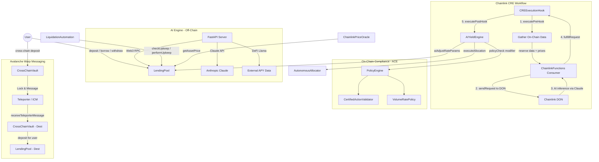
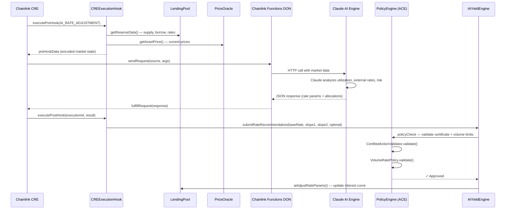
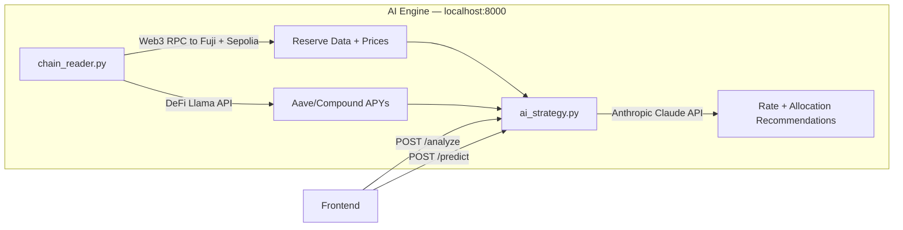
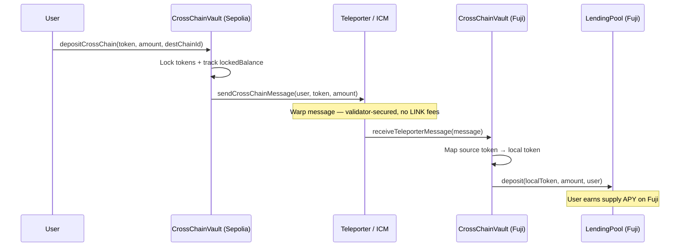

# AION Yield — AI-Orchestrated DeFi Lending Protocol

**AION Yield** is a decentralized money market protocol where AI agents autonomously optimize interest rates, rebalance liquidity across protocols, and maximize risk-adjusted yields — all orchestrated by **Chainlink CRE** and secured by on-chain compliance policies.

> **The Problem:** DeFi lending is reactive. Capital sits idle in static pools while market conditions shift faster than any human can respond. Rate parameters are set manually, liquidity stays fragmented across chains, and there's no autonomous loop to continuously optimize yield.
>
> **AION's Solution:** We built an autonomous "Analyze → Validate → Execute" loop. Chainlink CRE reads on-chain state, routes it to an AI engine (Anthropic Claude), validates the AI's recommendations through on-chain compliance policies (ACE), and applies optimized rate parameters and cross-protocol allocations — all without manual intervention. The result: a self-optimizing lending protocol that continuously adapts to market conditions across multiple chains.

[](https://build.avax.network/)
[]()
[](https://chain.link/)
[](https://anthropic.com/)
[](https://docs.avax.network/)

**Live Deployment:** Avalanche Fuji (primary) + Ethereum Sepolia testnets | All contracts [source-verified on SnowTrace](#verified-smart-contracts)

---

## Architecture



---

## How the Protocol Works

### 1. Lending & Borrowing

At its core, AION Yield is a decentralized money market. Users deposit assets (USDC) into the **LendingPool** and receive interest-bearing **aTokens** that automatically grow in value as borrowers pay interest. Borrowers post collateral and take loans against it, paying a variable borrow rate.

The protocol tracks every position's **health factor** — the ratio of collateral value to debt value. If a borrower's health factor drops below 1.0 (meaning their collateral no longer safely covers their debt), their position becomes eligible for liquidation. **Chainlink Automation** continuously monitors all positions and triggers liquidations when needed, ensuring the protocol stays solvent.

Asset prices are sourced from **Chainlink Data Feeds**, providing reliable, tamper-resistant pricing with staleness checks and fallback logic.

### 2. AI-Powered Rate Optimization

This is what makes AION different from static lending protocols. Instead of fixed interest rate parameters, an AI engine (Anthropic Claude) continuously analyzes market conditions and recommends optimal rate curve adjustments.

The AI engine reads live on-chain data — current utilization, supply/borrow volumes, liquidity depth — and benchmarks AION's rates against competitors like Aave V3 and Compound using DeFi Llama data. It then recommends adjustments to four key parameters: `baseRate`, `slope1` (normal borrowing zone), `slope2` (penalty zone above optimal utilization), and `optimalUtilization` (the kink point). These recommendations are applied on-chain through the **AIYieldEngine**, which updates the LendingPool's interest rate curve in real time.

### 3. Autonomous Orchestration (Chainlink CRE)

The **CRE (Compute Runtime Environment)** is the autonomous loop that makes this work without human intervention. It operates in three phases:

- **Analyze:** The CREExecutionHook gathers on-chain state — reserve data, prices, allocator positions — and packages it for off-chain processing.
- **Validate:** AI recommendations pass through the **ACE (Automated Compliance Engine)** before execution. This on-chain policy framework enforces guardrails: EIP-712 signed certificates must authorize each action, and volume/rate limits prevent any single action from exceeding 10% of TVL or 5 actions per hour.
- **Execute:** Approved recommendations are applied on-chain — rate parameters updated, liquidity rebalanced across protocols, or risk alerts triggered.

The CRE supports five workflow types: AI Rate Adjustment, Liquidation Scanning, Cross-Chain Rebalance, Risk Monitoring, and Yield Allocation.

### 4. Cross-Chain Deposits (Avalanche Warp Messaging)

Users on Ethereum Sepolia can deposit directly into the Avalanche Fuji LendingPool without manually bridging tokens. The **CrossChainVault** uses Avalanche's native Warp Messaging (via Teleporter/ICM) with a **Lock & Message** pattern:

1. User calls `depositCrossChain()` on the source chain vault
2. Tokens are locked on the source chain
3. A Warp message is sent via Teleporter (no LINK fees, validator-secured)
4. The destination vault receives the message and auto-deposits from its pre-funded reserves into the LendingPool
5. User immediately starts earning supply APY on the destination chain

This approach was chosen over CCIP because it provides native Avalanche integration with fast finality and zero bridging fees.

### 5. AI Agent Economy

AION implements an **ERC-8004-inspired agent registry** where AI agents must register, stake tokens, and maintain reputation scores to participate. This creates accountability — agents that produce bad recommendations can be slashed. The **x402 payment protocol** handles micropayments for each AI inference, with revenue distributed through the AIRevenueDistributor: 70% to the agent pool, 15% as top-agent bonuses, 10% to the community, and 5% to the protocol reserve.

---

## CRE Workflow — End-to-End Flow

The diagram below shows a single pass of the autonomous optimization loop — from data gathering through AI analysis to on-chain execution:



---

## AI Engine (Off-Chain)

The AI engine is a Python FastAPI server that serves as the intelligence layer. It reads live on-chain data from both Avalanche Fuji and Ethereum Sepolia, fetches competitive APY data from DeFi Llama, and uses Anthropic Claude to produce actionable rate and allocation recommendations.



**Multi-Chain Support:** The AI engine reads on-chain data from both Avalanche Fuji and Ethereum Sepolia via configurable chain routing. Each endpoint accepts a `chain` parameter (`fuji` or `sepolia`) to target the correct deployment.

**What Claude Analyzes:**
- Current utilization vs optimal target (75-85%)
- AION rates vs Aave V3 and Compound (competitive benchmarking)
- Risk factors: concentration, liquidity depth, market volatility
- Optimal interest curve parameters: `baseRate`, `slope1`, `slope2`, `optimalUtilization`
- Cross-protocol allocation split: AION pool vs Aave vs Morpho

**Key files:**
- [`ai_strategy.py`](ai-engine/ai_strategy.py) — Claude prompt engineering and response parsing
- [`chain_reader.py`](ai-engine/chain_reader.py) — Web3 on-chain data fetching
- [`main.py`](ai-engine/main.py) — FastAPI endpoints (`/analyze`, `/predict`, `/reserve`, `/price`)

---

## Cross-Chain Deposits

Users on one chain can deposit directly into another chain's LendingPool using Avalanche's native Warp Messaging. No manual bridging required.



**Why Lock & Message with Teleporter?** We use Avalanche's native Warp Messaging (via Teleporter/ICM) instead of CCIP for cross-chain communication. Tokens are locked on the source chain, a Warp message is sent (no LINK fees, validator-secured), and the destination vault deposits from its pre-funded reserves. This gives us native Avalanche integration with fast finality and zero bridging fees.

---

## Interest Rate Model

The protocol uses a **kink-based interest rate model** (similar to Aave/Compound) that the AI continuously optimizes:

```
Borrow Rate
     │
300% │                          ╱
     │                        ╱
     │                      ╱  ← Slope2 (penalty zone — AI tunes this)
 6%  │─────────────────────╱
     │               ╱
 2%  │─────────╱          ← Slope1 (normal zone — AI tunes this)
     │  ╱
     │╱________________________
     0%        80%       100%
            Utilization
          (AI-optimized kink)
```

- **Supply APY** = borrowRate × utilization × (1 - reserveFactor)
- **Health Factor** = Σ(collateral × liquidationThreshold) / Σ(debt) — liquidated if < 1.0

---

## Project Structure

```
├── smartcontract/           # Hardhat v3, Solidity contracts
│   ├── contracts/
│   │   ├── chainlink/       # CRE, Teleporter, Functions, Automation, Price Feeds
│   │   ├── core/            # LendingPool, InterestRateModel, Governance
│   │   ├── ace/             # PolicyEngine, CertifiedAction, VolumeRate
│   │   ├── ai/              # AIYieldEngine, AutonomousAllocator, AgentRegistry
│   │   └── payments/        # X402 Payment Gateway
│   ├── test/                # Hardhat tests (LendingPool, CrossChain, Liquidation)
│   └── scripts/             # Deploy and configuration scripts
├── frontend/                # Next.js 15, Framer Motion, Wagmi, Reown AppKit
├── ai-engine/               # FastAPI, Python, Anthropic Claude
│   ├── main.py              # API server
│   ├── ai_strategy.py       # Claude-powered analysis
│   └── chain_reader.py      # On-chain data reader
└── doc/                     # Technical documentation
```

---

## Verified Smart Contracts

All contracts are source-verified on their respective block explorers.

### Avalanche Fuji (Testnet) — [SnowTrace](https://testnet.snowtrace.io)

| Contract | Address | Explorer |
|----------|---------|----------|
| LendingPool | `0x3547aD159ACAf2660bc5E26E682899D11826c068` | [SnowTrace](https://testnet.snowtrace.io/address/0x3547aD159ACAf2660bc5E26E682899D11826c068#code) |
| AIYieldEngine | `0x104895cc071Fb53ba9d4851c0fe1B896dCEB558A` | [SnowTrace](https://testnet.snowtrace.io/address/0x104895cc071Fb53ba9d4851c0fe1B896dCEB558A#code) |
| AutonomousAllocator | `0x5A6259254dA9d37081E2FAd716885ad8393a5408` | [SnowTrace](https://testnet.snowtrace.io/address/0x5A6259254dA9d37081E2FAd716885ad8393a5408#code) |
| CrossChainVault | `0xf9f48fD24bfF611891Fa7608d5864445cf875E08` | [SnowTrace](https://testnet.snowtrace.io/address/0xf9f48fD24bfF611891Fa7608d5864445cf875E08#code) |
| CREExecutionHook | `0xb38A14851dEd07df71b66835fd4E4aF5055e1cC4` | [SnowTrace](https://testnet.snowtrace.io/address/0xb38A14851dEd07df71b66835fd4E4aF5055e1cC4#code) |
| PolicyEngine | `0x7f7787B37544675Ce556e40919Ba8B6Ca887a972` | [SnowTrace](https://testnet.snowtrace.io/address/0x7f7787B37544675Ce556e40919Ba8B6Ca887a972#code) |
| ChainlinkPriceOracle | `0xbf8528f513111b8352cdc649A5C9031a83dB3e20` | [SnowTrace](https://testnet.snowtrace.io/address/0xbf8528f513111b8352cdc649A5C9031a83dB3e20#code) |
| InterestRateModel | `0x39E1ae10B36E43Ee386d53E120B7b4B81dA99D40` | [SnowTrace](https://testnet.snowtrace.io/address/0x39E1ae10B36E43Ee386d53E120B7b4B81dA99D40#code) |
| LiquidationAutomation | `0x4b40D1cFc427B1353e9E4896ac1b844eAB489dA1` | [SnowTrace](https://testnet.snowtrace.io/address/0x4b40D1cFc427B1353e9E4896ac1b844eAB489dA1#code) |
| ChainlinkFunctionsConsumer | `0x15e4F3BB2664e55Be254f82b10d4A51900A1aBc1` | [SnowTrace](https://testnet.snowtrace.io/address/0x15e4F3BB2664e55Be254f82b10d4A51900A1aBc1#code) |
| MockUSDC | `0xa35C19170526eB8764a995fb5298eD1156B1b379` | [SnowTrace](https://testnet.snowtrace.io/address/0xa35C19170526eB8764a995fb5298eD1156B1b379#code) |
| AToken (aUSDC) | `0xce1833a1B9b8155C63C27a4313fB753283056573` | [SnowTrace](https://testnet.snowtrace.io/address/0xce1833a1B9b8155C63C27a4313fB753283056573#code) |
| VariableDebtToken | `0x3f250ae87AD1AF74Fae9F6B52D291DdEd43E9972` | [SnowTrace](https://testnet.snowtrace.io/address/0x3f250ae87AD1AF74Fae9F6B52D291DdEd43E9972#code) |
| AIAgentRegistry | `0x514F088eBE73cfb7aeb39b87e6cC21cD869a8c29` | [SnowTrace](https://testnet.snowtrace.io/address/0x514F088eBE73cfb7aeb39b87e6cC21cD869a8c29#code) |
| AIRevenueDistributor | `0xe6F9a61112DC9b1D80bc3274292623cC19dc98bF` | [SnowTrace](https://testnet.snowtrace.io/address/0xe6F9a61112DC9b1D80bc3274292623cC19dc98bF#code) |
| ProtocolFeeController | `0x552f1A08DfF1bd434178789e1D0C5Ff0f618F086` | [SnowTrace](https://testnet.snowtrace.io/address/0x552f1A08DfF1bd434178789e1D0C5Ff0f618F086#code) |
| CertifiedActionValidatorPolicy | `0x8DEA4bAd54d04adddC609e5BCe197757498e9b5b` | [SnowTrace](https://testnet.snowtrace.io/address/0x8DEA4bAd54d04adddC609e5BCe197757498e9b5b#code) |
| VolumeRatePolicy | `0x750c40739D69b5a5C59e311d7cc603bAc3137C46` | [SnowTrace](https://testnet.snowtrace.io/address/0x750c40739D69b5a5C59e311d7cc603bAc3137C46#code) |

### Sepolia (Ethereum Testnet) — [Etherscan](https://sepolia.etherscan.io)

| Contract | Address | Explorer |
|----------|---------|----------|
| LendingPool | `0x87Ff17e9A8f23D02E87d6E87B5631A7eE08C0248` | [Etherscan](https://sepolia.etherscan.io/address/0x87Ff17e9A8f23D02E87d6E87B5631A7eE08C0248#code) |
| AIYieldEngine | `0x4a8Ec2D9655600bc5d5D3460e8680251C839E61D` | [Etherscan](https://sepolia.etherscan.io/address/0x4a8Ec2D9655600bc5d5D3460e8680251C839E61D#code) |
| AutonomousAllocator | `0x7C9eF492Cc14A795d8BAa6937b4cF23F258Ce6f1` | [Etherscan](https://sepolia.etherscan.io/address/0x7C9eF492Cc14A795d8BAa6937b4cF23F258Ce6f1#code) |
| CrossChainVault | `0x5a41D93Edc7016Cb2c27CC897751063a9e3dDDc3` | [Etherscan](https://sepolia.etherscan.io/address/0x5a41D93Edc7016Cb2c27CC897751063a9e3dDDc3#code) |
| CREExecutionHook | `0x17562500756BaB6757E13ce84C6D207A4D144948` | [Etherscan](https://sepolia.etherscan.io/address/0x17562500756BaB6757E13ce84C6D207A4D144948#code) |
| PolicyEngine | `0x2CfD29a609F822f734e70950a02Db066566d2faA` | [Etherscan](https://sepolia.etherscan.io/address/0x2CfD29a609F822f734e70950a02Db066566d2faA#code) |
| ChainlinkPriceOracle | `0xdBF02AeBf96D1C3E8B4E35f61C27A37cc6f601e4` | [Etherscan](https://sepolia.etherscan.io/address/0xdBF02AeBf96D1C3E8B4E35f61C27A37cc6f601e4#code) |
| MockUSDC | `0x331cB2F787b2DC57855Bb30B51bE09aEF53e84C0` | [Etherscan](https://sepolia.etherscan.io/address/0x331cB2F787b2DC57855Bb30B51bE09aEF53e84C0#code) |

---

## Getting Started

```bash
# Clone
git clone https://github.com/ChainNomads/AION-Yield.git && cd AION-Yield

# Smart Contracts
cd smartcontract && npm install
cp .env.example .env  # Add RPC URLs + private key
npx hardhat compile

# AI Engine
cd ai-engine && pip install -r requirements.txt
export ANTHROPIC_API_KEY=your_key
uvicorn main:app --host 0.0.0.0 --port 8000

# Frontend
cd frontend && npm install && npm run dev
```

---

## Tech Stack

| Layer | Technology |
|-------|-----------|
| Smart Contracts | Solidity 0.8.20, Hardhat v3, OpenZeppelin |
| Chainlink | CRE, Functions, Automation, Data Feeds, ACE |
| Cross-Chain | Avalanche Warp Messaging (Teleporter/ICM) |
| AI | Anthropic Claude via FastAPI + Web3.py |
| Frontend | Next.js 15, Framer Motion, Wagmi v2, Reown AppKit |
| Networks | Avalanche Fuji (primary), Ethereum Sepolia |

---

## Team: AION-YIELD
