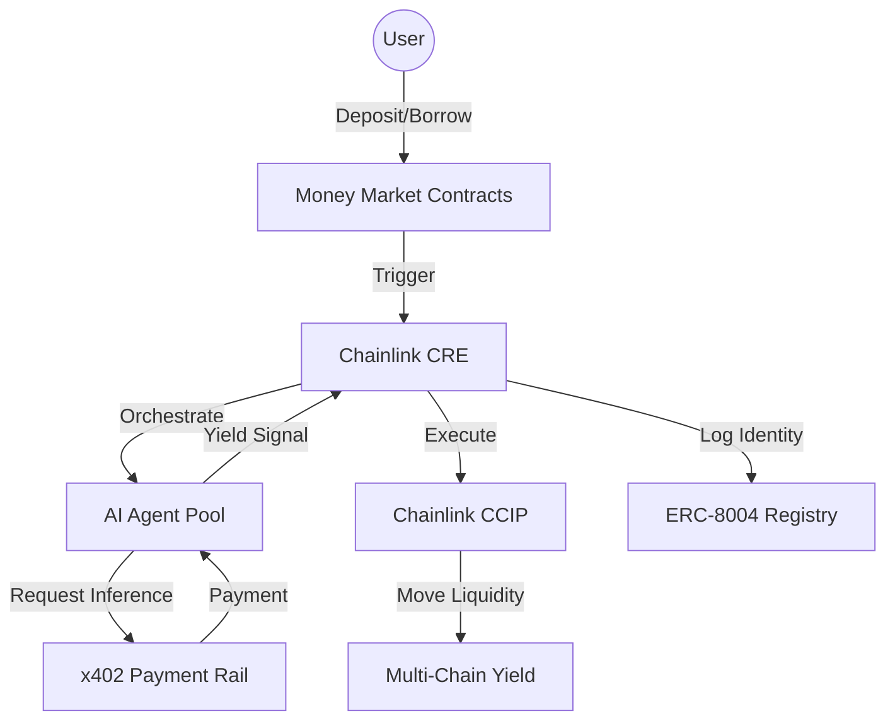

<p align="center">
  <a href="https://chain.link/" target="blank"></a>
</p>

<p align="center">
  <a href="https://chain.link/" target="_blank"></a>
  <a href="https://base.org/" target="_blank"></a>
  <a href="https://github.com/ethereum/ERCs" target="_blank"></a>
  <a href="https://x402.org/" target="_blank"></a>
</p>

<p align="center">
  A next-generation decentralized money market protocol orchestrating <strong>AI-driven yield optimization</strong> and <strong>autonomous agent payments</strong> via Chainlink CRE.
</p>
<p align="center">
  Built for the <strong>Chainlink Convergence Hackathon</strong>.
</p>

---

## 📌 Overview

**AION Yield** moves beyond passive lending. It utilizes autonomous AI agents to manage capital, forecast liquidation risks, and optimize cross-chain yield. The protocol showcases the power of the **Chainlink Runtime Environment (CRE)** to orchestrate complex workflows between smart contracts, AI models, and off-chain data.

### The "AION" Innovation:

- **Autonomous Orchestration:** Chainlink CRE acts as the "Operating System" for the protocol.
- **AI-Native Rails:** Uses **x402** (HTTP 402) for machine-to-machine inference payments.
- **On-Chain Identity:** Implements **ERC-8004** for AI agent reputation and validation.

---

## 🏗️ Technical Architecture



---

## 🧩 Chainlink Service Integration

| Service                  | Purpose in AION Yield                                                          |
| :----------------------- | :----------------------------------------------------------------------------- |
| **Chainlink CRE**        | The core workflow engine orchestrating AI, CCIP, and Automation.               |
| **Chainlink CCIP**       | Secure cross-chain liquidity and collateral management across Base & Ethereum. |
| **Chainlink Functions**  | Fetching off-chain AI inference and risk scores.                               |
| **Chainlink Automation** | Decentralized triggers for liquidations and vault rebalancing.                 |
| **Chainlink Data Feeds** | Real-time pricing for interest rate models and health factor calculation.      |
| **Data Streams**         | High-frequency data for low-latency liquidation detection.                     |

---

## 💸 Machine-to-Machine Economy (x402 & ERC-8004)

### x402: Autonomous Payments

AION Yield revives the **HTTP 402 Payment Required** status code. When the protocol needs a yield prediction, the AI agent returns a 402 error; the protocol automatically settles the payment in USDC, receives the inference, and executes the strategy.

### ERC-8004: Agent Identity & Reputation

To ensure the protocol only uses high-performing AI, we utilize an ERC-8004 inspired registry:

- **Identity:** Verifiable on-chain identity for AI agents.
- **Reputation:** Historical performance scores based on previous yield predictions.
- **Staking:** Agents must stake tokens to provide signals, which are slashed for malicious/poor data.

---

## 📂 Project Structure

This is a monorepo containing the full protocol stack:

- **`smartcontract/`**: Hardhat-based Solidity environment for the Money Market core and AI registries.
- **`frontend/`**: Next.js dashboard for users to track positions and AI-driven yield.
- **`subgraph/`**: The Graph protocol indexing for historical protocol metrics.
- **`AION-Yield-ai_driven_..._readme.md`**: Detailed architectural deep-dive.
- **`aion_yield_issues_and_task_tracker.md`**: Active development roadmap and task list.

---

## 🚀 Getting Started

### Prerequisites

- Node.js v18+
- Hardhat / Foundry
- Base RPC & Testnet ETH

### Installation

1. Clone the repo:
   ```bash
   git clone https://github.com/ChainNomads/AION-Yield.git
   cd AION-Yield
   ```
2. Install dependencies (Frontend, Smart Contract, Subgraph):

   ```bash
   npm install
   cd frontend && npm install
   cd ../smartcontract && npm install
   ```

3. Setup environment variables:
   Copy `.env.example` to `.env` in both `frontend/` and `smartcontract/` directories and fill in your keys.

---

## 🗺️ Roadmap

- [x] **Phase 0:** Project architecture & repository scaffolding.
- [ ] **Phase 1:** Core Lending & Borrowing on Base.
- [ ] **Phase 2:** Chainlink CRE integration for AI orchestration.
- [ ] **Phase 3:** x402 Payment middleware implementation.
- [ ] **Phase 4:** ERC-8004 Reputation dashboard.

---

## 🤝 Team

**ChainNomads** – Building the future of autonomous finance.

---
