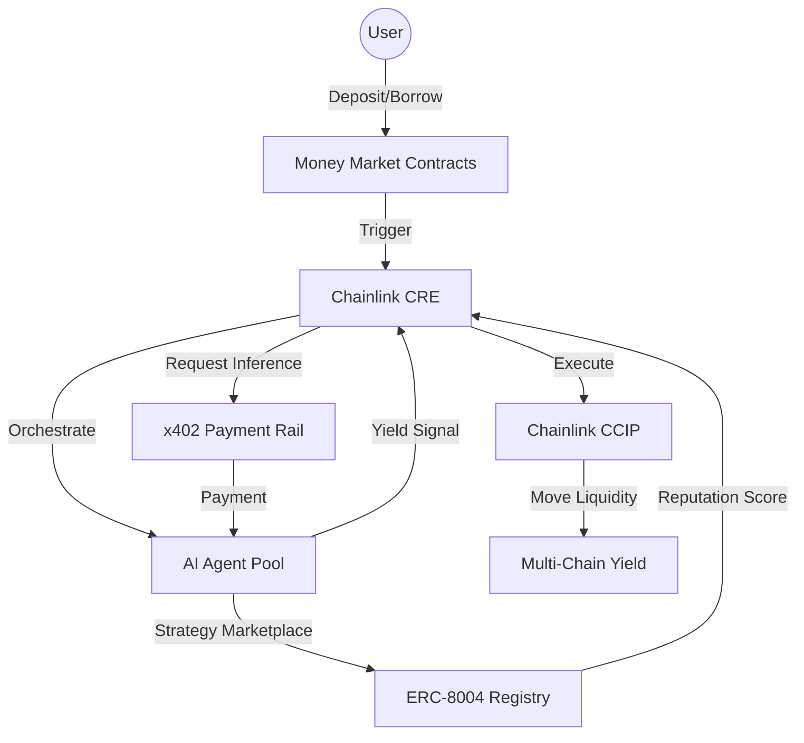

# 🚀 AION Yield – AI-Orchestrated Money Market Protocol

[](https://chain.link/)
[](https://base.org/)
[](https://linear.app/)
[](https://github.com/ethereum/ERCs)
[](https://x402.org/)

---

## 📌 The "AION" Differentiator

AION Yield moves beyond passive lending. It utilizes autonomous AI agents to manage capital, forecast liquidation risks, and optimize cross-chain yield via a machine-to-machine DeFi economy.

### 🧠 Core Innovation Pillars:
- **Autonomous Yield Engine:** AI portfolio allocators (Sigma-7, StableMax) dynamically scan Aave, Morpho, and Pendle to route capital to the best risk-adjusted yield.
- **Portfolio Intelligence:** Institutional-grade performance tracking with AI prediction forecasting and 12-month wealth projections.
- **Strategy Marketplace:** A competitive ecosystem where multiple AI agents (ERC-8004 tokens) compete for user capital based on verifiable on-chain reputation.
- **Live Strategy Feed:** A real-time timeline of AI actions—rebalancing, risk-mitigation, and yield-harvesting.

---

## 🏗️ Technical Architecture



---

## 🧩 Chainlink Service Integration

| Service                  | Purpose in AION Yield                                                          |
| :----------------------- | :----------------------------------------------------------------------------- |
| **Chainlink CRE**        | The "OS" orchestrating AI agents, CCIP routes, and protocol state.             |
| **Chainlink CCIP**       | Secure cross-chain liquidity and unified collateral management.                |
| **Chainlink Functions**  | Securely fetching off-chain AI inference results and risk scores.              |
| **Chainlink Automation** | Decentralized cron jobs for liquidations and auto-rebalancing.                 |
| **Chainlink Data Feeds** | Real-time pricing with institutional-grade fallback oracle logic.               |
| **Data Streams**         | Low-latency data for high-performance liquidation monitoring.                  |

---

## ✨ Studio Grade Experience

AION Yield features a bespoke UI inspired by the world's most premium FinTech platforms:
- **Zinc/Neutral Aesthetic:** High-contrast, minimalist design for maximum data density.
- **8pt Grid System:** Perfectly aligned layouts for a professional, "Studio-Grade" feel.
- **Advanced Visuals:** Magic Cards (mouse-following gradients), Health Gauges, and Animated Data Beams for real-time protocol observability.

---

## 📂 Project Structure

- **`smartcontract/`**: Hardhat environment for LendingPool, AI registries (ERC-8004), and x402 Escrows.
- **`frontend/`**: Next.js 15 App Router with Framer Motion and custom "Studio" components.
- **`subgraph/`**: PENDING - The Graph indexing for protocol telemetry.
- **`AION-yield_breakdown.md`**: Comprehensive project vision and implementation phases.
- **`AION-yield_issues_n_task_tracker.md`**: Active development roadmap and detailed status audit.

---

## 🚀 Getting Started

### Installation

1. Clone and install root dependencies:
   ```bash
   git clone https://github.com/ChainNomads/AION-Yield.git
   npm install
   ```
2. Setup sub-packages:
   ```bash
   cd frontend && npm install
   cd ../smartcontract && npm install
   ```

### Running Locally
- **Frontend:** `npm run dev` (inside `frontend/`)
- **Contracts:** `npx hardhat test` (inside `smartcontract/`)

---

## 🗺️ Roadmap (Audit: March 2026)

- [x] **Phase 1:** Core Money Market logic & Chainlink Price Feeds (Fallback enabled).
- [x] **Phase 2:** Studio Grade UI Refactor & Advanced Portfolio Dashboards.
- [ ] **Phase 3:** Chainlink CRE Integration & AI Inference Workflows.
- [ ] **Phase 4:** x402 Payment middleware & ERC-8004 Reputation system.
- [ ] **Phase 5:** Live Strategy Feed & Risk Intelligence Dashboard.
- [ ] **Phase 6:** AI Yield Simulator & Strategy Marketplace Launch.

---

## 🤝 Team
**ChainNomads** – Engineering the Autonomous Economy.

---
