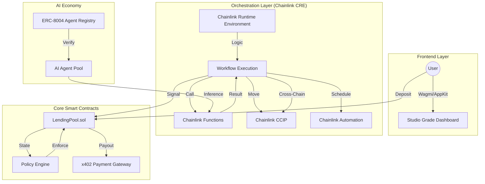

# 🚀 AION Yield – AI-Orchestrated Money Market Protocol

**AION Yield** is a next-generation decentralized money market protocol that bridges institutional DeFi with the autonomous agent economy. Built for the **Chainlink Convergence Hackathon**, it leverages **Chainlink CRE** as its core orchestration engine, **CCIP** for cross-chain liquidity, and **x402** for machine-to-machine financial settlement.

---

## 🏛️ Executive Summary

### The Problem
Traditional DeFi lending is **reactive**. Capital remains static in low-yield pools while market opportunities move faster than users can respond. Furthermore, AI agents—though capable of advanced strategy—lack crypto-native identity layers and seamless payment rails to settle with protocols they service.

### The Solution: AION
AION Yield transforms capital from passive to **autonomous**. It transitions the lending protocol into an AI-orchestrated environment where:
1.  **AI Agents** (Sigma-7, StableMax) provide real-time yield signals and risk predictions.
2.  **Chainlink CRE** orchestrates the "Analyze -> Pay -> Rebalance" loop without manual intervention.
3.  **x402 Gateway** settles inference fees in USDC automatically between the protocol and AI engines.
4.  **ERC-8004 Identity** ensures AI agents are ranked by verifiable, on-chain performance.

---

## 🏗️ Technical Architecture

AION Yield operates as a multi-layered ecosystem:

---

## 🔗 Chainlink Integration (Hackathon Core)

AION Yield is a deep-tech demonstration of the **Chainlink Convergence** vision:

*   **[Chainlink CRE (Orchestration)](https://github.com/ChainNomads/AION-Yield/blob/main/smartcontract/contracts/chainlink/CREExecutionHook.sol)**: The "OS" that coordinates agent selection, x402 payment triggers, and subsequent liquidity movement.
*   **[Chainlink CCIP](https://github.com/ChainNomads/AION-Yield/blob/main/smartcontract/contracts/chainlink/CrossChainVault.sol)**: Enables "Unified Collateral," allowing a user to deposit on Base and borrow against it on Avalanche, optimized by AI.
*   **[Chainlink Functions](https://github.com/ChainNomads/AION-Yield/blob/main/smartcontract/contracts/chainlink/ChainlinkFunctionsConsumer.sol)**: The secure bridge to our Python AI Strategy Engine, handling encrypted inference requests.
*   **[Chainlink Automation](https://github.com/ChainNomads/AION-Yield/blob/main/smartcontract/contracts/chainlink/LiquidationAutomation.sol)**: Decentralized "Watchdogs" that monitor AI risk scores and execute preventive liquidations.
*   **[Chainlink Price Feeds](https://github.com/ChainNomads/AION-Yield/blob/main/smartcontract/contracts/chainlink/ChainlinkPriceOracle.sol)**: Multi-source price data with institutional-grade fallback logic.

---

## 🤖 The Autonomous Economy Core

### x402: Machine-to-Machine Payments
We implemented the [x402 (HTTP 402 Payment Required)](https://github.com/ChainNomads/AION-Yield/blob/main/smartcontract/contracts/payments/X402PaymentGateway.sol) protocol standard. When an AI Agent provides a yield prediction, the protocol settles the fee in USDC on-chain automatically, creating a self-sustaining economy for machine intelligence.

### ERC-8004: Agent Identity & Reputation
Every AI agent is a participant in our [ERC-8004 Registry](https://github.com/ChainNomads/AION-Yield/blob/main/smartcontract/contracts/ai/AIAgentRegistry.sol). They earn points for accuracy and are slashed for high-deviation predictions, ensuring capital is only managed by the most "Reputable" models.

---

## ✨ Studio Grade Experience (UI/UX)

The AION dashboard is built for high-stakes financial observability:
*   **Design Tokens**: Zinc/Neutral palette (`#09090b`) with a bespoke Cyan-Blue accent (`#0EA7CB`).
*   **Tactile Aesthetic**: A 3% noise/grain overlay and an 8pt grid system for a premium, heavy-duty feel.
*   **Magic Cards**: Components with real-time radial glow effects that track movements, highlighting key AI insights.
*   **Health Intelligence**: Circular "Stress Gauges" and "Yield Beams" visualize the live flow of capital rebalancing.

---

## 📂 Project Structure

- **`smartcontract/`**: Hardhat, Solidity (Lending, ACE, Payments, Registries).
- **`frontend/`**: Next.js 15, Framer Motion, Wagmi, Tailwind CSS.
- **`ai-engine/`**: FastAPI, Python, Anthropic Claude 3.5.
- **`doc/`**: Full technical guides (API, Workflows, Whitepaper).

---

## 🚀 Getting Started

1.  **Clone**: `git clone https://github.com/ChainNomads/AION-Yield.git`
2.  **API Keys**: Add `ANTHROPIC_API_KEY` to `ai-engine/` and standard RPCs to `smartcontract/`.
3.  **Run AI**: `cd ai-engine && pip install -r requirements.txt && uvicorn main:app`
4.  **Run App**: `cd frontend && npm install && npm run dev`

---

## 🤝 Team: **ChainNomads**
*Engineering the Autonomous DeFi Economy.*
