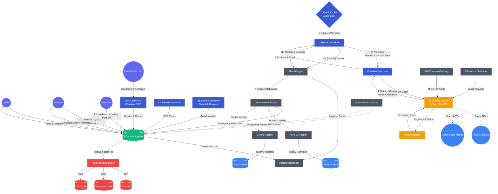

# AION Yield Smart Contracts Overview

This document provides a comprehensive explanation of every smart contract implementation within the AION Yield protocol.

## System Architecture & User Flow

The following diagram illustrates how user funds enter the protocol, how Chainlink orchestrates the AI workflow, and how the Autonomous Allocator automatically moves liquidity to external protocols for maximum yield.



---

## 1. Core Module (`contracts/core/`)

These contracts handle the fundamental money market mechanics, parameter governance, and fee management.

### `LendingPool.sol`

**Purpose:** The central engine of the protocol. This is where users interact to deposit assets, borrow against collateral, repay loans, and trigger liquidations.

**Mechanics:** Inspired by the Fluid DEX V2 Liquidity Layer. It maintains individual asset reserves, accrues interest over time by incrementing RAY-precision indices (`liquidityIndex` and `variableBorrowIndex`), and calculates dynamic Health Factors to ensure system solvency.

**Key Functions:**
- `deposit(asset, amount, onBehalfOf)` - Deposit assets and mint aTokens representing the deposit.
- `withdraw(asset, amount, to)` - Burn aTokens and receive underlying. Validates the withdrawal won't break the user's health factor.
- `borrow(asset, amount, onBehalfOf)` - Borrow against collateral. Requires HF > 1.0 after the borrow.
- `repay(asset, amount, onBehalfOf)` - Repay outstanding debt, burning VariableDebtTokens.
- `liquidate(collateralAsset, debtAsset, user, debtToCover, receiveAToken)` - Liquidate an undercollateralized position. Enforces a **50% close factor** (max half the debt can be covered per liquidation) and a **5% liquidation bonus** (10500 bps) to incentivize liquidators.
- `setUserUseReserveAsCollateral(asset, useAsCollateral)` - Toggle whether a deposited asset counts as collateral.

**Interest Accrual:** On every state-changing call, `_updateState(asset)` calculates elapsed time, queries the `InterestRateModel` for current rates, and compounds both the supply index (for lenders) and the borrow index (for borrowers) using RAY math.

**Health Factor Calculation:** `HF = sum(collateral * price * liquidationThreshold) / totalDebt`. Positions with HF < 1.0 (1e18) are liquidatable.

---

### `InterestRateModel.sol`

**Purpose:** Math library that determines how much interest borrowers pay and lenders earn based on real-time market utilization.

**Mechanics:** Implements a "kink" model adapted from Fluid DEX V2's `calcRateV1`:
- **Below optimal utilization (80%):** Rates rise slowly along slope1 (default 4% RAY).
- **Above optimal utilization:** Rates spike sharply along slope2 (default 300% RAY) to encourage repayments and discourage further borrowing.

**Formula:**
```
if utilization <= kink:
    borrowRate = baseRate + (utilization * slope1) / kink
else:
    borrowRate = baseRate + slope1 + ((utilization - kink) * slope2) / (1 - kink)

supplyRate = borrowRate * utilization * (1 - reserveFactor)
```

**AI Integration:** The AIYieldEngine can call `setRateParams(asset, baseRate, slope1, slope2, optimalUtilization)` to dynamically adjust these parameters based on market conditions, effectively letting the AI tune the interest rate curves in real-time.

---

### `GovernanceController.sol`

**Purpose:** Manages protocol upgrades, parameter changes, and emergency halts in a secure, transparent way.

**Mechanics:** Follows a "Slow Upgrades, Fast Pauses" philosophy:
- **Standard changes** follow a `Proposal -> Timelock Queue -> Execute` pipeline. The default timelock is 24 hours (configurable between 1 hour and 30 days), with a 14-day grace period before proposals expire.
- **Emergency actions** can be triggered instantly by the Guardian (a trusted role), but the Guardian can only **pause** the protocol, never unpause it. Only the owner can unpause.
- **Parameter bounds** can be set per parameter hash to prevent extreme values from being proposed.

**Key Roles:**
- `owner` - Can queue proposals, execute after timelock, unpause, manage governed contracts.
- `guardian` - Can pause protocol immediately, cancel queued proposals, execute emergency actions on governed contracts. Cannot unpause.

---

### `ProtocolFeeController.sol`

**Purpose:** The protocol's treasury and revenue router.

**Mechanics:** Collects fees from multiple sources and distributes them according to configurable ratios:

**Fee Sources:**
- **Reserve Factor** - A per-asset percentage of interest income (up to 50% max). Configured per asset.
- **Flash Loan Fees** - Currently 0.09% (9 bps), max 1%.
- **Liquidation Protocol Share** - 10% of liquidation bonuses go to the protocol.

**Distribution Ratios (default):**
| Destination | Share |
|---|---|
| Treasury | 50% |
| Insurance Fund | 30% |
| Development Fund | 20% |

The `distributeFees(asset)` function can be called by anyone to trigger distribution of accrued fees for a given asset.

---

## 2. Artificial Intelligence Module (`contracts/ai/`)

These contracts bridge the gap between deterministic blockchain logic and probabilistic AI inference.

### `AIAgentRegistry.sol`

**Purpose:** On-chain identity, staking, and reputation system for AI models. Inspired by ERC-8004.

**Mechanics:** Implements three core registries:

1. **Identity Registry** - AI operators register agents by staking a minimum amount of collateral tokens and providing an IPFS metadata URI. Agents start with a base reputation score of 1000. Optional governance-controlled whitelist can restrict who can register.

2. **Reputation Registry** - The protocol owner can adjust reputation scores based on prediction outcomes. Accurate predictions earn +10 reputation, inaccurate predictions lose -20 (asymmetric to punish bad predictions more). Agents can also be slashed (default 10% of stake) for severe misbehavior, which halves their reputation.

3. **Validation Registry** - Records each prediction against its actual outcome. Calculates deviation in basis points and marks the prediction as passed/failed based on a configurable maximum deviation threshold.

**Agent Selection:** `getTopAgents(n)` returns the top N agents by reputation score, used to determine which AI models should provide predictions for the protocol.

---

### `AIYieldEngine.sol`

**Purpose:** The dual-mode executor that applies AI logic to the protocol.

**Mechanics:** Operates in two modes:

- **Mode 1 -- Rate Optimization (Internal):** Receives yield predictions and rate recommendations from off-chain AI models (delivered via `ChainlinkFunctionsConsumer`). Stores predictions with confidence scores and can forward recommended rate parameters (baseRate, slope1, slope2, optimalUtilization) to the `InterestRateModel`.

- **Mode 2 -- Allocation Optimization (Cross-Protocol):** Receives allocation decisions from the AI and forwards them to the `AutonomousAllocator`, which moves liquidity across Aave V3, Morpho Blue, and future integrations.

**Access Control:** Only authorized callers (set by `setAuthorizedCaller`) can submit predictions. The `ChainlinkFunctionsConsumer` is authorized during deployment.

---

### `AutonomousAllocator.sol`

**Purpose:** AI-driven cross-protocol yield allocator powered by Chainlink CRE. Manages autonomous rebalancing of user assets across multiple DeFi protocols to maximize risk-adjusted yield.

**Architecture:**
```
┌──────────────────────────────────────────────────────┐
│                  AutonomousAllocator                  │
│                                                      │
│  Emergency Buffer (15%)  |  AI Strategy  |  Limits   │
│                          │               │           │
│  ┌───────────────────────┼───────────────┐           │
│  │       Protocol Adapter Layer          │           │
│  │  AION Pool  |  Aave V3  |  Morpho    │           │
│  └───────────────────────────────────────┘           │
└──────────────────────────────────────────────────────┘
```

**Safety Features:**
- **Emergency Buffer** - Always keeps a configurable percentage (default 15%) in the AION LendingPool to ensure instant user withdrawals.
- **Per-Protocol Caps** - Limits maximum allocation to any single external protocol (concentration risk guard).
- **Cooldown** - Minimum 4 hours between rebalances (configurable, minimum 1 hour) to prevent manipulation.
- **Minimum Confidence** - When autonomous mode is enabled, requires 75%+ AI confidence to execute.
- **Emergency Withdrawal** - Owner can pull all funds from any or all external protocols instantly.

**Rebalance Flow (`executeAllocation`):**
1. Validate cooldown and confidence thresholds
2. Verify allocations sum to 100% and respect per-protocol caps
3. Enforce emergency buffer (first allocation must be AION pool >= buffer %)
4. **Pass 1:** Withdraw from over-allocated protocols
5. **Pass 2:** Deposit into under-allocated protocols

This two-pass approach ensures liquidity is always available before new deposits are made, preventing temporary insolvency.

---

## 3. Chainlink Integration Module (`contracts/chainlink/`)

These contracts utilize Chainlink's suite of decentralized services to securely bring off-chain data and compute on-chain.

### `ChainlinkFunctionsConsumer.sol`

**Purpose:** The bridge to execute arbitrary off-chain API requests, such as pinging a Python FastAPI AI model for yield predictions and risk assessments.

**Mechanics:** Manages three types of configurable source code slots:
- Slot 0: Yield Prediction
- Slot 1: Risk Assessment
- Slot 2: Rate Optimization

**Request Flow:**
1. `sendRequest(targetAsset, sourceType, args)` initiates a Chainlink Functions request with the configured source code.
2. The Chainlink DON executes the JavaScript source off-chain, which calls the AI model API.
3. `fulfillRequest(requestId, response, err)` is called back with the result.
4. The response is decoded as an `InferenceResult` tuple: `(predictedAPY, riskScore, confidence, recommendedBaseRate, recommendedSlope1, recommendedSlope2, recommendedOptimalUtilization)`.
5. The prediction is forwarded to `AIYieldEngine.submitPrediction()`, and if rate recommendations are included (`recommendedBaseRate > 0`), those are forwarded to `AIYieldEngine.submitRateRecommendation()`.

**Tracking:** Every request is recorded with its requester, target asset, source type, timestamps, and fulfillment status. Per-asset request history is maintained for auditing.

---

### `CREExecutionHook.sol`

**Purpose:** Manages stateful Chainlink Compute Runtime Environment (CRE) workflows for complex multi-step protocol operations.

**Mechanics:** Supports five workflow types, each following a `Pre-Hook -> Off-Chain Compute -> Post-Hook` lifecycle:

| Type | Description |
|---|---|
| `AI_RATE_ADJUSTMENT` | Gather pool utilization data, AI optimizes rate curves, apply new parameters |
| `LIQUIDATION_SCAN` | Scan borrower positions, identify unhealthy ones, trigger liquidations |
| `CROSS_CHAIN_REBALANCE` | Check cross-chain pool balances, move liquidity via CCIP |
| `RISK_MONITORING` | Continuous health checks across positions and protocols |
| `YIELD_ALLOCATION` | Scan Aave/Morpho APYs, AI computes optimal split, forward to AutonomousAllocator |

**Workflow Lifecycle:**
1. **Registration** - Owner registers a workflow with its type and configuration metadata.
2. **Pre-Hook** (`executePreHook`) - Authorized executor triggers the workflow. Contract validates the workflow is active and records execution start. Returns `preHookData` for off-chain processing.
3. **Off-Chain Compute** - Chainlink CRE processes the data externally.
4. **Post-Hook** (`executePostHook`) - Executor submits results. Contract validates the pre-hook was executed, processes the result, and marks the workflow as `COMPLETED` or `FAILED`.

**Access Control:** Executors must be explicitly authorized via `setAuthorizedExecutor()`.

---

### `ChainlinkPriceOracle.sol`

**Purpose:** Securely monitors real-time USD values for assets in the LendingPool.

**Mechanics:** Reads from standard Chainlink AggregatorV3 price feeds with comprehensive safety checks:

- **Primary + Fallback Feeds** - Each asset can have a primary and optional fallback price feed. If the primary feed fails or returns stale data, the oracle automatically switches to the fallback.
- **Staleness Detection** - Configurable per-asset `maxStaleness` (default 1 hour). If `block.timestamp - updatedAt > maxStaleness`, the price is marked invalid.
- **Zero/Negative Price Rejection** - Answers <= 0 are rejected as invalid.
- **Revert Handling** - If a feed's `latestRoundData()` call reverts, the oracle catches the error and falls back gracefully.
- **Decimal Normalization** - All prices are normalized to 8 decimals (`PRICE_DECIMALS`), regardless of the feed's native precision.

**Two Getter Modes:**
- `getAssetPrice(asset)` returns `(price, isValid)` - never reverts, caller decides what to do with invalid prices.
- `getAssetPriceOrRevert(asset)` - reverts with "Stale price" or "Zero price" if no valid price is available.

---

### `LiquidationAutomation.sol`

**Purpose:** Decentralizes the liquidation process using Chainlink Automation (Keepers) so the protocol doesn't rely on centralized bots.

**Mechanics:** Implements the Chainlink `AutomationCompatibleInterface`:

- `checkUpkeep(bytes)` - Called off-chain by Keepers. Iterates through tracked users (up to `maxCheckPerCall`, default 50), skipping those in cooldown (default 60 seconds). Returns `upkeepNeeded = true` if any user has HF < 1.0, along with the encoded list of liquidatable addresses.
- `performUpkeep(bytes performData)` - Called on-chain by Keepers. Decodes the address list, re-validates each user's health factor (in case it changed between check and perform), and emits `LiquidationTriggered` events. In production, this would execute actual `LendingPool.liquidate()` calls.

**User Tracking:** The owner manages the tracked user set via `trackUser(address)` and `untrackUser(address)`.

---

### `CrossChainVault.sol`

**Purpose:** Enables omnichain deposits using Chainlink CCIP (Cross-Chain Interoperability Protocol).

**Mechanics:** Implements `CCIPReceiver` for handling incoming cross-chain messages:

- **Deposit from another chain:** A user on Arbitrum/Optimism/etc. sends a CCIP message to this vault. The vault decodes the message, credits the user's deposit in the LendingPool, and mints yield-bearing aTokens on their behalf.
- **Withdraw to another chain:** Users can initiate a cross-chain withdrawal, which burns their aTokens, withdraws underlying from the LendingPool, and sends a CCIP message back with the tokens.

The contract uses the LINK token for CCIP fees and maintains a list of allowed chains/senders for security.

---

## 4. Protocol Adapters Module (`contracts/interfaces/`)

### `IProtocolAdapter.sol`

**Purpose:** Standard interface that every external DeFi protocol adapter must implement to integrate with the `AutonomousAllocator`.

**Interface Methods:**
```solidity
function deposit(address asset, uint256 amount) external returns (uint256 actualDeposited);
function withdraw(address asset, uint256 amount) external returns (uint256 actualWithdrawn);
function emergencyWithdraw(address asset) external returns (uint256 withdrawn);
function getProtocolState(address asset) external view returns (ProtocolState memory);
function getBalance(address asset) external view returns (uint256);
function getCurrentAPY(address asset) external view returns (uint256);
function protocolName() external view returns (string memory);
function isActive() external view returns (bool);
```

**ProtocolState** includes: `totalDeposited`, `currentAPY` (RAY precision), `availableLiquidity`, `utilizationRate`, `riskScore` (0-10000 bps), and `lastUpdateTime`.

Adding a new protocol integration (e.g., Compound, Euler) requires only deploying a new adapter contract that implements this interface.

---

## 5. Payments Module (`contracts/payments/`)

Contracts focused on compensating third-party AI models and community contributors.

### `X402PaymentGateway.sol`

**Purpose:** An escrow and settlement layer implementing the HTTP 402 (Payment Required) concept for machine-to-machine AI payments.

**Payment Flow:**
```
Protocol (Requester) -> AI API (Provider) -> HTTP 402 Payment Required
       |                                              |
       v                                              v
 X402PaymentGateway -> USDC Transfer -> AI Provider Receives Payment
       |
       v
  AI Result Returned
```

**Mechanics:**
1. **Escrow Management** - Requesters deposit USDC (or native ETH when enabled) into an escrow balance. This pool funds all future inference payments automatically.
2. **Payment Processing** - When an AI inference is requested, `processPayment(requestId, payer, provider)` deducts the provider's configured price from the payer's escrow, sends the payment minus a protocol fee (default 1%, max 10%) to the provider.
3. **Batch Payments** - `batchProcessPayments()` settles multiple inference payments in a single transaction for gas efficiency.
4. **Refunds** - The owner can refund completed payments in case of dispute (e.g., failed inference).
5. **Provider Management** - Providers are registered with a per-inference price. Providers can update their own prices.

**Native Token Support:** When `nativePaymentsEnabled` is true, ETH can be deposited and used for payments via `depositNative()` and `processNativePayment()`.

---

### `AIRevenueDistributor.sol`

**Purpose:** Epoch-based revenue distribution system for AI agents participating in the protocol.

**Revenue Flow:**
```
x402 Payment Gateway -> Revenue Pool (This) -> Distribution to Agents
                              |
                              |-> Top Agent Bonus Pool (15%)
                              |-> Community Pool (10%)
                              |-> Protocol Reserve (5%)
                              |-> Agent Share (70%)
```

**Mechanics:**

**Epoch System:** Revenue is accumulated in 7-day epochs. After an epoch ends, anyone can call `advanceEpoch()` to start the next one. Past epochs are finalized by the owner via `finalizeEpoch()`.

**Distribution (default ratios):**
| Destination | Share | Description |
|---|---|---|
| Agent Share | 70% | Distributed pro-rata based on each agent's revenue contribution in the epoch |
| Top Agent Bonus | 15% | Extra reward pool for the top 5 agents by reputation score, distributed proportionally by reputation |
| Community Pool | 10% | Sent to a community-controlled address |
| Protocol Reserve | 5% | Sent to the protocol reserve for operational expenses |

**Claiming:** After epoch finalization, agents accumulate claimable balances. They can claim all at once via `claimRevenue()` or partially via `claimRevenuePartial(amount)`.

**Vesting Support:** The contract includes a `VestingSchedule` struct for implementing scheduled vesting (currently available for future use).

---

## 6. Tokens Module (`contracts/tokens/`)

### `AToken.sol`

**Purpose:** Yield-bearing token representing a lender's deposit (e.g., aWETH for deposited WETH).

**Mechanics:** Uses scaled balances internally (`_scaledBalances`) that remain constant, while the apparent balance grows over time as the `liquidityIndex` increases. The actual balance is: `balance = scaledBalance * liquidityIndex / RAY`.

**Key Functions:**
- `mint(user, amount, index)` - Called by LendingPool on deposit. Mints scaled tokens.
- `burn(user, receiverOfUnderlying, amount, index)` - Called by LendingPool on withdrawal. Burns scaled tokens and transfers underlying.
- `transferOnLiquidation(from, to, amount, index)` - Transfers scaled balances during liquidation (when `receiveAToken = true`).
- `getBalance(user, currentIndex)` - Returns the actual balance including accrued interest.
- `balanceOfScaled(user)` - Returns the raw scaled balance.

**Access Control:** Only the LendingPool can call `mint`, `burn`, and `transferOnLiquidation` (enforced by `onlyPool` modifier).

---

### `VariableDebtToken.sol`

**Purpose:** Token representing a borrower's variable-rate debt.

**Mechanics:** Functions identically to AToken in terms of scaled balance accounting, but represents a liability. The debt grows over time as the `variableBorrowIndex` increases.

- `mint(user, amount, index)` - Called by LendingPool on borrow.
- `burn(user, amount, index)` - Called by LendingPool on repay or liquidation.
- `getBalance(user, currentIndex)` - Returns current debt including accrued interest.

---

## 7. Libraries (`contracts/libraries/`)

### `MathUtils.sol`
Core math library providing RAY (1e27) and WAD (1e18) precision arithmetic: `rayMul`, `rayDiv`, `wadMul`, `wadDiv`, `calculateCompoundedInterest`. Also defines `PERCENTAGE_FACTOR = 10000` for basis point calculations.

### `DataTypes.sol`
Shared data structures used across the protocol: `ReserveData`, `UserReserveData`, `InterestRateParams`, `AIAgentData`, `AIPrediction`, `AIRecommendedRates`, and `InferenceResult`.

---

## Deployed Addresses

### Ethereum Sepolia Testnet

| Contract | Address |
|---|---|
| InterestRateModel | `0x67e1a242dfa9160f558c18aE306722f5a360c77b` |
| LendingPool | `0x87Ff17e9A8f23D02E87d6E87B5631A7eE08C0248` |
| ChainlinkPriceOracle | `0xdBF02AeBf96D1C3E8B4E35f61C27A37cc6f601e4` |
| AIYieldEngine | `0x77F1FCEcCB6C186C3df22F3E7f7586D51E40bfF2` |
| LiquidationAutomation | `0xcC1bd02c59888b64bdC7125a1999B8e87F8259FE` |
| ChainlinkFunctionsConsumer | `0x39E1ae10B36E43Ee386d53E120B7b4B81dA99D40` |
| CrossChainVault | `0x3547aD159ACAf2660bc5E26E682899D11826c068` |
| AutonomousAllocator | `0xbf8528f513111b8352cdc649A5C9031a83dB3e20` |
| CREExecutionHook | `0x17562500756BaB6757E13ce84C6D207A4D144948` |

### Avalanche Fuji Testnet

| Contract | Address |
|---|---|
| InterestRateModel | `0x39E1ae10B36E43Ee386d53E120B7b4B81dA99D40` |
| LendingPool | `0x3547aD159ACAf2660bc5E26E682899D11826c068` |
| ChainlinkPriceOracle | `0xbf8528f513111b8352cdc649A5C9031a83dB3e20` |
| AIYieldEngine | `0x17562500756BaB6757E13ce84C6D207A4D144948` |
| LiquidationAutomation | `0x4b40D1cFc427B1353e9E4896ac1b844eAB489dA1` |
| ChainlinkFunctionsConsumer | `0x15e4F3BB2664e55Be254f82b10d4A51900A1aBc1` |
| CrossChainVault | `0x331cB2F787b2DC57855Bb30B51bE09aEF53e84C0` |
| AutonomousAllocator | `0xbE9963F0058837759C3Cedc5FA1Ac3991bB8A957` |
| CREExecutionHook | `0xb38A14851dEd07df71b66835fd4E4aF5055e1cC4` |

---

## Contract Dependency Graph

```
LendingPool
  ├── InterestRateModel (rate calculations)
  ├── AToken (deposit receipts)
  ├── VariableDebtToken (debt tracking)
  ├── ChainlinkPriceOracle (asset prices for HF calculation)
  └── ProtocolFeeController (fee collection)

AIYieldEngine
  ├── LendingPool (reads pool state)
  ├── InterestRateModel (updates rate params)
  └── AutonomousAllocator (forwards allocation decisions)

ChainlinkFunctionsConsumer
  └── AIYieldEngine (submits predictions & rate recommendations)

CREExecutionHook
  ├── LendingPool
  ├── AIYieldEngine
  ├── LiquidationAutomation
  ├── CrossChainVault
  └── AutonomousAllocator

AutonomousAllocator
  ├── AIYieldEngine (receives rebalance instructions)
  └── IProtocolAdapter[] (Aave, Morpho, etc.)

LiquidationAutomation
  └── LendingPool (checks HF, triggers liquidations)

CrossChainVault
  └── LendingPool (deposits/withdrawals on behalf of cross-chain users)

X402PaymentGateway
  └── AIRevenueDistributor (revenue flows to distribution)

AIRevenueDistributor
  └── AIAgentRegistry (reputation data for bonus distribution)

GovernanceController
  └── Any governed contract (timelocked parameter changes)
```

---

## Security Model

| Layer | Mechanism |
|---|---|
| **Access Control** | OpenZeppelin `Ownable` on all admin functions. Authorized caller patterns for inter-contract communication. |
| **Reentrancy** | `ReentrancyGuard` on LendingPool, AutonomousAllocator, AIRevenueDistributor. |
| **Oracle Safety** | Dual-feed with staleness checks, zero/negative price rejection, decimal normalization. |
| **Liquidation Safety** | 50% close factor, 5% bonus, HF re-validation in performUpkeep, cooldown between liquidations. |
| **Governance Safety** | Timelock (1h-30d), guardian emergency pause (no unpause), parameter bounds, grace period expiry. |
| **Allocation Safety** | Emergency buffer, per-protocol caps, cooldown, confidence thresholds, two-pass rebalance. |
| **Fee Safety** | Capped reserve factors (50%), flash loan fees (1%), liquidation shares (50%). Distribution ratios must sum to 100%. |
